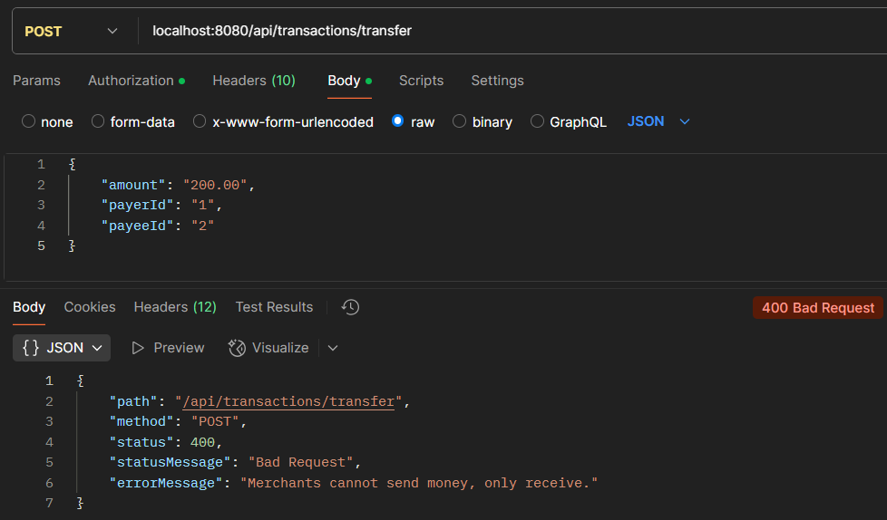
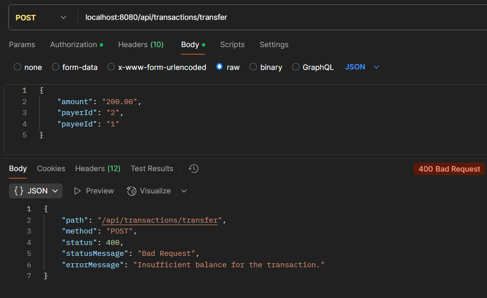

# Desafio Back-end PicPay

O PicPay Simplificado é uma plataforma de pagamentos simplificada. Nela é possível depositar e realizar transferências
de dinheiro entre usuários. 

Temos 2 tipos de usuários, os comuns e lojistas, ambos têm carteira com dinheiro e realizam
transferências entre eles.

Link do desafio: [picpay-desafio-backend-github](https://github.com/PicPay/picpay-desafio-backend)

### Tecnologias Utilizadas
- Java
- Spring Boot
- Autenticação com JWT (JSON Web Token)
- Cache em memória (Spring Cache)
- Maven
- H2 Database
- Mapstruct
- Lombok
- Testes unitários com JUnit e Mockito

### Requisitos do Desafio
Lojistas só recebem transferências:



Validar se o usuário tem saldo antes da transferência:



### Endpoint de Transferência

```http request
POST /transfer
Content-Type: application/json

{
  "value": 100.0,
  "payer": 4,
  "payee": 15
}
```

### Diagrama de Classes


### Configuração e Execução
Pré-requisitos: Java 17 e Maven

1. clone o repositório
2. acesse o diretório do projeto
3. configure o banco de dados no application.yml

```bash
# instale as dependências do Maven
mvn clean install

# execute a aplicação
mvn spring-boot:run

# pressione (ctrl + c) para encerrar a aplicação
```

### Autor

- Projeto desenvolvido por [Isabel Henrique](https://www.linkedin.com/in/isabel-henrique/)
- Fique à vontade para contribuir!
