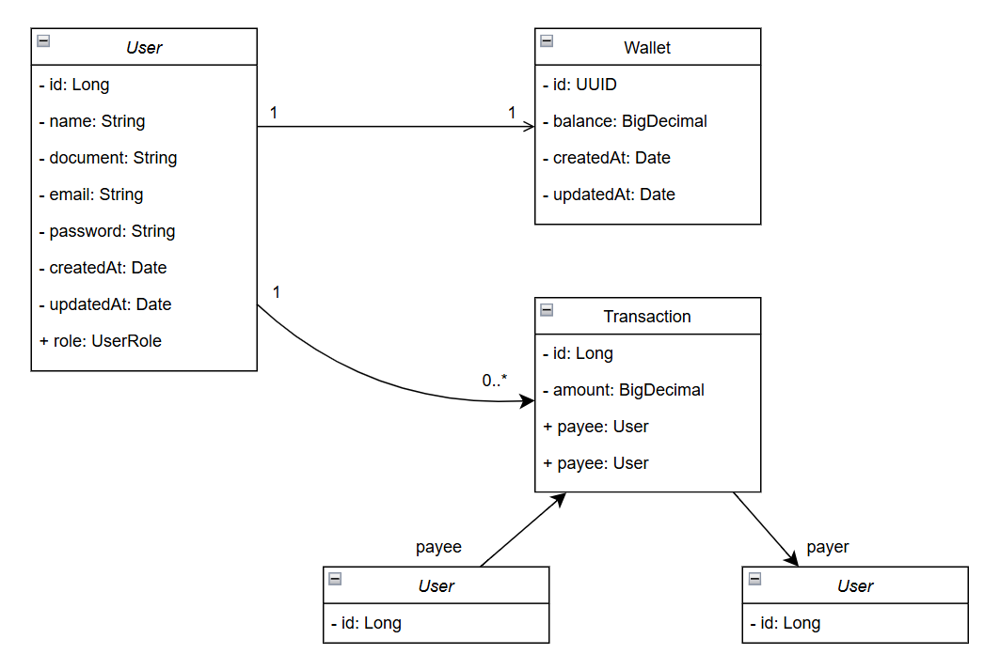

# Desafio Back-end PicPay

O PicPay Simplificado é uma plataforma de pagamentos simplificada. Nela é possível depositar e realizar transferências
de dinheiro entre usuários. Temos 2 tipos de usuários, os comuns e lojistas, ambos têm carteira com dinheiro e realizam
transferências entre eles.

Link do desafio: [picpay-desafio-backend-github](https://github.com/PicPay/picpay-desafio-backend)

### Tecnologias utilizadas
- Java
- Spring Boot
- Autenticação com JWT (JSON Web Token)
- Maven
- H2 Database
- Mapstruct
- Lombok
- Testes unitários com JUnit e Mockito

### Diagrama de Classes


### Endpoint de transferência

```http request
POST /transfer
Content-Type: application/json

{
  "value": 100.0,
  "payer": 4,
  "payee": 15
}
```

### Requisitos

A seguir estão algumas regras de negócio que são importantes para o funcionamento do PicPay Simplificado:

- Para ambos tipos de usuário, precisamos do `Nome Completo`, `CPF`, `e-mail` e `Senha`. CPF/CNPJ e e-mails devem ser
  únicos no sistema. Sendo assim, seu sistema deve permitir apenas um cadastro com o mesmo CPF ou endereço de e-mail;

- Usuários podem enviar dinheiro (efetuar transferência) para lojistas e entre usuários;

- Lojistas **só recebem** transferências, não enviam dinheiro para ninguém;

- Validar se o usuário tem saldo antes da transferência;

- Antes de finalizar a transferência, deve-se consultar um serviço autorizador externo, use este mock
  [https://util.devi.tools/api/v2/authorize](https://util.devi.tools/api/v2/authorize) para simular o serviço
  utilizando o verbo `GET`;

- A operação de transferência deve ser uma transação (ou seja, revertida em qualquer caso de inconsistência) e o
  dinheiro deve voltar para a carteira do usuário que envia;

- No recebimento de pagamento, o usuário ou lojista precisa receber notificação (envio de email, sms) enviada por um
  serviço de terceiro e eventualmente este serviço pode estar indisponível/instável. Use este mock
  [https://util.devi.tools/api/v1/notify)](https://util.devi.tools/api/v1/notify)) para simular o envio da notificação
  utilizando o verbo `POST`;

### Configuração e Execução
Pré-requisitos: Java 17 e Maven

1. clone o repositório
2. acesse o diretório do projeto
3. configure o banco de dados no application.yml

```bash
# instale as dependências do Maven
mvn clean install

# execute a aplicação
mvn spring-boot:run

# pressione (ctrl + c) para encerrar a aplicação
```

### Autor

- Projeto desenvolvido por [Isabel Henrique](https://www.linkedin.com/in/isabel-henrique/)
- Fique à vontade para contribuir!
